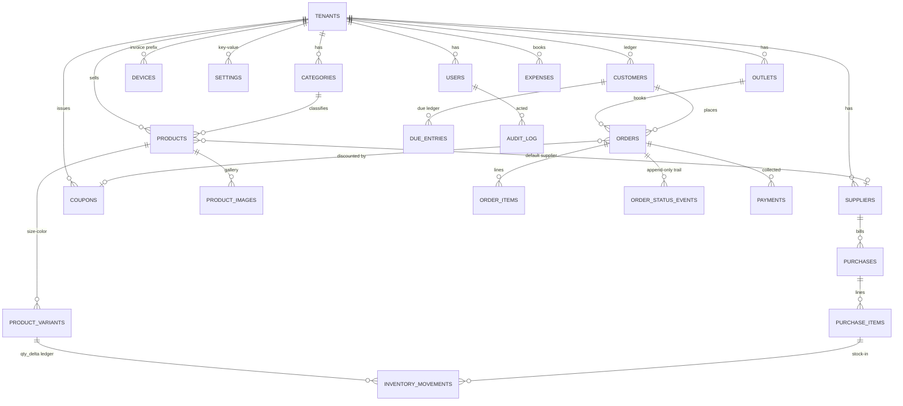

# D1 (SQLite) ডেটাবেজ স্কিমা ডিজাইন — JxShoes Shop Management

> স্ট্যাটাস: ড্রাফট ডিজাইন (বাস্তবায়ন হয়নি)। এই ডকুমেন্ট শুধু ডিজাইন — কোনো মাইগ্রেশন ফাইল/কোড এখানে নেই।
> সূত্র: বর্তমান অ্যাপের ডেটা শেপ `src/types/index.ts`, `src/types/fullStoreData.ts`, `src/lib/store.ts`, `src/lib/compute.ts`, `src/lib/initialData.ts`, `src/lib/offline/*`, `docs/OFFLINE_SYNC.md` থেকে বের করা।

---

## ১. আজকের অবস্থা এক নজরে

- পুরো দোকানের ডেটা এখন **একটাই JSON blob** — সার্ভারে Cloudflare KV কি `jx_store_state`, অফলাইনে IndexedDB মিররে হুবহু একই শেপ (`FullStoreData`)। প্রতিটা লেখায় পুরো blob read-modify-write হয় — রেস-কন্ডিশন ও স্কেলের মূল ঝুঁকি।
- AI রিপোর্ট/ইনসাইট/ডেইলি ব্রিফ/নোটিফিকেশন/মিডিয়া লাইব্রেরি আলাদা KV কিতে ছড়ানো (`jx_ai_reports`, `jx_ntf_*`, `jx_media_library`…)।
- **কোনো relational ডেটাবেজ নেই**, তাই multi-tenant, multi-outlet, ইউজার/পারমিশন, সাপ্লায়ার-পারচেজ, অডিট — কিছুই নেই। এই স্কিমা সেই ঘাটতি পূরণ করে।

---

## ২. মূল ডিজাইন সিদ্ধান্ত (সংক্ষেপে)

| বিষয় | সিদ্ধান্ত | কারণ |
|---|---|---|
| Primary Key | `TEXT` — ULID বা UUIDv7, **ক্লায়েন্ট জেনারেট করবে** | অফলাইনে আইডি ছাড়া রেকর্ড তৈরি করা যায়; সিঙ্কে আইডি বদলাতে হয় না (বর্তমান `localId('ord')` → `-off-` টেম্প আইডি সমস্যার স্থায়ী সমাধান)। ULID/UUIDv7 লেক্সিকোগ্রাফিক = কালানুক্রমিক, তাই সাজানো সস্তা |
| Multi-tenancy | প্রতিটা টেবিলে `tenant_id NOT NULL` + সব ইনডেক্সে প্রথম কলাম | এক D1-তে একাধিক দোকান; প্রতি-টেনান্ট ডেটা আইসোলেশন কোয়েরি লেভেলেই |
| Soft delete | প্রতিটা টেবিলে `deleted_at TEXT NULL` (`NULL` = জীবিত) | অফলাইন ডিলিটও রেকর্ড হয় (tombstone সিঙ্ক হয়); হার্ড ডিলিট শুধু রিটেনশন পলিসিতে |
| Versioning | প্রতিটা টেবিলে `version INTEGER NOT NULL DEFAULT 1` — প্রতি আপডেটে +1 | লাস্ট-রাইটার-উইনের বদলে conflict ডিটেকশন; সিঙ্ক পুলে `(tenant_id, updated_at)` + version |
| টাকা | `INTEGER` **পয়শায়** (৳১ = ১০০ পয়শা), কখনো float নয় | float যোগ-বিয়োগে ভগ্নাংশ ত্রুটি; বাকির খাতা ও লাভ-ক্ষতি নিখুঁত রাখতে হবে |
| স্টক | **সত্য = `SUM(inventory_movements.qty_delta)`**; `stock_cached` শুধু ক্যাশ, একই লেনদেনে `+= delta` | append-only লেজার — যেকোনো সময় হিসাব যাচাইযোগ্য |
| কাস্টমার বাকি | **সত্য = `SUM(due_entries.amount)`**; `due_cached` শুধু ক্যাশ, `+= delta` | বর্তমান `Math.max(0, ...)` ক্ল্যাম্প ভুল লুকায় — লেজারে ক্ল্যাম্প নেই |
| Append-only | orders (আর্থিক বিষয়বস্তু), payments, inventory_movements, due_entries কখনো UPDATE/DELETE হয় না | সংশোধন = রিভার্সাল এন্ট্রি; অডিট ট্রেইল অটোমেটিক |
| ইনভয়েস নম্বর | `D01-000123` — ডিভাইস-প্রিফিক্স + ডিভাইস-লোকাল ক্রম | দুই ডিভাইস অফলাইনে সমান্তরাল বিক্রি করলেও collision হয় না (বর্তমান `SK-${random}` ভুল শোনার সম্ভাবনা খুব বেশি) |
| নেগেটিভ স্টক | **আটকানো হয় না** — মুভমেন্ট রেকর্ড + পতাকা + অ্যালার্ট | অফলাইন বিক্রি ব্যর্থ হতে পারে না; বিস্তারিত §৬.৪ |
| লেনদেন | D1-তে `BEGIN TRANSACTION` নেই — multi-statement আণবিক লেখা হবে `db.batch()` দিয়ে | অর্ডার + আইটেম + মুভমেন্ট + due_entry + ক্যাশ-ডেল্টা এক ব্যাচে; batch-এর অ্যাটমিসিটি শব্দাবলি অফিসিয়াল ডকে যাচাই করা যায়নি (§৯) |

---

## ৩. Mermaid ER ডায়াগ্রাম (প্রধান টেবিল)



সহায়ক টেবিল (ডায়াগ্রামে নেই): `notifications`, `feedback`, `media_assets`, `ai_artifacts`, `idempotency_keys`, `change_log`।

---

## ৪. কনভেনশন (প্রতিটা টেবিলে বাধ্যতামূলক)

```sql
-- প্রতিটা টেবিলের সাধারণ কলাম (প্রতিটা DDL-এ এগুলো থাকবে; নিচে বারবার লেখা হয়েছে)
--   id          TEXT PRIMARY KEY            -- ULID/UUIDv7, ক্লায়েন্ট-জেনারেটেড
--   tenant_id   TEXT NOT NULL REFERENCES tenants(id)
--   created_at  TEXT NOT NULL               -- ISO-8601 UTC (মিরর/অ্যাপের সাথে সামঞ্জস্য; লেক্সিকোগ্রাফিক সর্ট = সময় সর্ট)
--   updated_at  TEXT NOT NULL               -- সিঙ্ক পুলের কার্সর (hot index: (tenant_id, updated_at))
--   deleted_at  TEXT                        -- NULL = জীবিত; tombstone সিঙ্ক হয়
--   version     INTEGER NOT NULL DEFAULT 1  -- প্রতি UPDATE-এ +1; append-only টেবিলে সবসময় 1
```

- `updated_at` নিজে থেকে বদলায় না (SQLite-এ ট্রিগার লাগে) — অ্যাপ লেয়ারে প্রতি লেখায় সেট করতে হবে।
- টাকার কলামের নাম `_p` প্রত্যয় (যেমন `total_p`) = পয়শা। `REAL` টাইপ শুধু `rating`-এর মতো টাকা-বহির্ভূত সংখ্যায়।
- এনাম মান `CHECK` দিয়ে ধরা, তবে ভবিষ্যৎ মান যোগ করতে মাইগ্রেশন লাগবে — সিদ্ধান্ত: আপাতত `CHECK`, খোলা প্রশ্ন §৮.৯।
- Foreign key ব্যবহার করা হয়েছে; D1-এ প্রতিটি কানেকশনে FK enforcement ডিফল্ট অন — `db.batch()`-এর ভেতরে **স্টেটমেন্টের ক্রম** (parent আগে, child পরে) মানতে হবে।

---

## ৫. টেবিল DDL

### ৫.১ টেনান্ট / আউটলেট / ইউজার / ডিভাইস

```sql
CREATE TABLE tenants (
  id            TEXT PRIMARY KEY,              -- ULID
  name          TEXT NOT NULL,                 -- দোকান/ব্যবসার নাম
  slug          TEXT NOT NULL,                 -- URL/কোড শনাক্তকারী
  plan          TEXT NOT NULL DEFAULT 'single',
  created_at    TEXT NOT NULL,
  updated_at    TEXT NOT NULL,
  deleted_at    TEXT,
  version       INTEGER NOT NULL DEFAULT 1
);
CREATE UNIQUE INDEX ux_tenants_slug ON tenants(slug) WHERE deleted_at IS NULL;

CREATE TABLE outlets (
  id            TEXT PRIMARY KEY,
  tenant_id     TEXT NOT NULL REFERENCES tenants(id),
  code          TEXT NOT NULL,                 -- শর্ট কোড, যেমন 'MAIN'
  name          TEXT NOT NULL,
  address       TEXT,
  phone         TEXT,
  is_default    INTEGER NOT NULL DEFAULT 0,    -- single-shop মাইগ্রেশনে ১টাই default
  created_at    TEXT NOT NULL,
  updated_at    TEXT NOT NULL,
  deleted_at    TEXT,
  version       INTEGER NOT NULL DEFAULT 1
);
CREATE UNIQUE INDEX ux_outlets_tenant_code ON outlets(tenant_id, code) WHERE deleted_at IS NULL;
CREATE INDEX ix_outlets_tenant_updated ON outlets(tenant_id, updated_at);

CREATE TABLE users (
  id            TEXT PRIMARY KEY,
  tenant_id     TEXT NOT NULL REFERENCES tenants(id),
  name          TEXT NOT NULL,
  phone         TEXT,
  email         TEXT,
  password_hash TEXT,                          -- মালিক/স্টাফ লগইন (মালিকের সিদ্ধান্ত: §৮.৩)
  role          TEXT NOT NULL DEFAULT 'owner'  -- 'owner' | 'manager' | 'salesman'
                CHECK (role IN ('owner','manager','salesman')),
  outlet_id     TEXT REFERENCES outlets(id),   -- NULL = সব আউটলেট
  is_active     INTEGER NOT NULL DEFAULT 1,
  created_at    TEXT NOT NULL,
  updated_at    TEXT NOT NULL,
  deleted_at    TEXT,
  version       INTEGER NOT NULL DEFAULT 1
);
CREATE UNIQUE INDEX ux_users_tenant_phone ON users(tenant_id, phone) WHERE deleted_at IS NULL AND phone IS NOT NULL;
CREATE INDEX ix_users_tenant_updated ON users(tenant_id, updated_at);

-- ইনভয়েস প্রিফিক্স + ডিভাইস-লোকাল সিকোয়েন্স (§৬.৩)
CREATE TABLE devices (
  id            TEXT PRIMARY KEY,
  tenant_id     TEXT NOT NULL REFERENCES tenants(id),
  outlet_id     TEXT REFERENCES outlets(id),
  device_code   TEXT NOT NULL,                 -- প্রিফিক্স, যেমন 'D01' (অ্যাপ অ্যাক্সেসের ডিভাইস শনাক্ত করে)
  label         TEXT,                          -- মানুষের পড়ার জন্য: 'দোকানের ট্যাব', 'হোম পিসি'
  last_seq      INTEGER NOT NULL DEFAULT 0,    -- এই ডিভাইস এখন পর্যন্ত যত নম্বর নিয়েছে
  last_seen_at  TEXT,
  created_at    TEXT NOT NULL,
  updated_at    TEXT NOT NULL,
  deleted_at    TEXT,
  version       INTEGER NOT NULL DEFAULT 1
);
CREATE UNIQUE INDEX ux_devices_tenant_code ON devices(tenant_id, device_code) WHERE deleted_at IS NULL;
CREATE INDEX ix_devices_tenant_updated ON devices(tenant_id, updated_at);
```

### ৫.২ ক্যাটাগরি / সাপ্লায়ার / প্রোডাক্ট / ভ্যারিয়েন্ট / ছবি

```sql
CREATE TABLE categories (
  id            TEXT PRIMARY KEY,
  tenant_id     TEXT NOT NULL REFERENCES tenants(id),
  parent_type   TEXT NOT NULL DEFAULT 'shoes'  -- বর্তমান CategoryItem.parentType
                CHECK (parent_type IN ('shoes','bags','accessories')),
  name          TEXT NOT NULL,                 -- 'লোফার (Loafers)'
  slug          TEXT NOT NULL,
  image         TEXT,
  item_count_label TEXT,                       -- বর্তমান itemCountLabel — UI ডেকোরেশন
  position      INTEGER NOT NULL DEFAULT 0,
  created_at    TEXT NOT NULL,
  updated_at    TEXT NOT NULL,
  deleted_at    TEXT,
  version       INTEGER NOT NULL DEFAULT 1
);
CREATE UNIQUE INDEX ux_categories_tenant_slug ON categories(tenant_id, slug) WHERE deleted_at IS NULL;
CREATE INDEX ix_categories_tenant_updated ON categories(tenant_id, updated_at);

CREATE TABLE suppliers (
  id            TEXT PRIMARY KEY,
  tenant_id     TEXT NOT NULL REFERENCES tenants(id),
  name          TEXT NOT NULL,                 -- 'হাজারীবাগ প্রিমিয়াম লেদার ক্রাফট'
  phone         TEXT,
  address       TEXT,
  note          TEXT,
  created_at    TEXT NOT NULL,
  updated_at    TEXT NOT NULL,
  deleted_at    TEXT,
  version       INTEGER NOT NULL DEFAULT 1
);
CREATE INDEX ix_suppliers_tenant_updated ON suppliers(tenant_id, updated_at);

CREATE TABLE products (
  id            TEXT PRIMARY KEY,
  tenant_id     TEXT NOT NULL REFERENCES tenants(id),
  outlet_id     TEXT REFERENCES outlets(id),   -- NULL = সব আউটলেটে একই
  category_id   TEXT REFERENCES categories(id),
  sub_category  TEXT,                          -- বর্তমান free-text subCategory; ভবিষ্যতে sub-category টেবিল হতে পারে (§৮.৮)
  sku           TEXT NOT NULL,                 -- 'JX-SH-001'
  barcode       TEXT,                          -- '890100100101'
  name          TEXT NOT NULL,
  slug          TEXT NOT NULL,
  description   TEXT NOT NULL DEFAULT '',
  price_p       INTEGER NOT NULL CHECK (price_p >= 0),          -- খুচরা বিক্রয়মূল্য (পয়শা)
  cost_price_p  INTEGER,                                        -- ক্রয়মূল্য স্ন্যাপশট (ডিফল্ট)
  compare_at_price_p INTEGER,                                   -- বর্তমান originalPrice (কাটা দাম)
  min_stock_alert INTEGER NOT NULL DEFAULT 5,
  default_supplier_id TEXT REFERENCES suppliers(id),            -- বর্তমান free-text supplier
  is_featured   INTEGER NOT NULL DEFAULT 0,
  rating        REAL,                          -- টাকা নয় — display-only
  -- ===== ক্যাশড ডেরাইভড ব্যালেন্স (সত্য = SUM(inventory_movements.qty_delta); §৬.১) =====
  stock_cached  INTEGER NOT NULL DEFAULT 0,    -- সব ভ্যারিয়েন্টের যোগফল; লেনদেনে += delta
  created_at    TEXT NOT NULL,
  updated_at    TEXT NOT NULL,
  deleted_at    TEXT,
  version       INTEGER NOT NULL DEFAULT 1
);
CREATE UNIQUE INDEX ux_products_tenant_sku ON products(tenant_id, sku) WHERE deleted_at IS NULL;
CREATE UNIQUE INDEX ux_products_tenant_barcode ON products(tenant_id, barcode) WHERE deleted_at IS NULL AND barcode IS NOT NULL;
CREATE UNIQUE INDEX ux_products_tenant_slug ON products(tenant_id, slug) WHERE deleted_at IS NULL;
CREATE INDEX ix_products_tenant_updated ON products(tenant_id, updated_at);
CREATE INDEX ix_products_tenant_featured ON products(tenant_id, is_featured) WHERE deleted_at IS NULL;

CREATE TABLE product_images (
  id            TEXT PRIMARY KEY,
  tenant_id     TEXT NOT NULL REFERENCES tenants(id),
  product_id    TEXT NOT NULL REFERENCES products(id),
  url           TEXT NOT NULL,                 -- R2 URL বা data-URI (অফলাইন আপলোড ফলব্যাক; §৭ ম্যাপিং)
  position      INTEGER NOT NULL DEFAULT 0,
  created_at    TEXT NOT NULL,
  updated_at    TEXT NOT NULL,
  deleted_at    TEXT,
  version       INTEGER NOT NULL DEFAULT 1
);
CREATE INDEX ix_product_images_product ON product_images(product_id, position) WHERE deleted_at IS NULL;
CREATE INDEX ix_product_images_tenant_updated ON product_images(tenant_id, updated_at);

CREATE TABLE product_variants (
  id            TEXT PRIMARY KEY,
  tenant_id     TEXT NOT NULL REFERENCES tenants(id),
  product_id    TEXT NOT NULL REFERENCES products(id),
  sku           TEXT NOT NULL,                 -- 'JX-SH-001-42-BRN'
  size          TEXT NOT NULL,                 -- '42' বা '15.6 Inch Standard'
  color         TEXT NOT NULL,                 -- 'Deep Brown'
  color_hex     TEXT,
  price_p       INTEGER,                       -- NULL = প্রোডাক্টের price_p প্রযোজ্য
  cost_price_p  INTEGER,                       -- NULL = প্রোডাক্টের cost_price_p
  -- ===== ক্যাশড ব্যালেন্স (সত্য = SUM(movements)); লেনদেনে += delta, কখনো absolute নয় =====
  stock_cached  INTEGER NOT NULL DEFAULT 0,    -- নেগেটিভ হতে পারে (নীতি §৬.৪)
  created_at    TEXT NOT NULL,
  updated_at    TEXT NOT NULL,
  deleted_at    TEXT,
  version       INTEGER NOT NULL DEFAULT 1
);
CREATE UNIQUE INDEX ux_variants_tenant_sku ON product_variants(tenant_id, sku) WHERE deleted_at IS NULL;
CREATE UNIQUE INDEX ux_variants_tenant_attr ON product_variants(tenant_id, product_id, size, color) WHERE deleted_at IS NULL;
CREATE INDEX ix_variants_tenant_updated ON product_variants(tenant_id, updated_at);
CREATE INDEX ix_variants_tenant_stock ON product_variants(tenant_id, stock_cached);  -- low-stock রিপোর্ট
```

### ৫.৩ কাস্টমার / বাকির খাতা (due_entries)

```sql
CREATE TABLE customers (
  id            TEXT PRIMARY KEY,
  tenant_id     TEXT NOT NULL REFERENCES tenants(id),
  name          TEXT NOT NULL,
  phone         TEXT NOT NULL,                 -- আপসার্ট কি (বর্তমান অ্যাপের মতোই)
  address       TEXT,
  note          TEXT,
  -- ===== ক্যাশড ব্যালেন্স — সত্য = SUM(due_entries) ও SUM(orders); লেনদেনে += delta (§৬.২) =====
  due_cached        INTEGER NOT NULL DEFAULT 0,  -- পয়শা; ধনাত্মক = কাস্টমার বাকি দেবে; ক্ল্যাম্প নেই
  total_purchases_p INTEGER NOT NULL DEFAULT 0,  -- SUM(non-cancelled orders.total_p)
  order_count       INTEGER NOT NULL DEFAULT 0,
  created_at    TEXT NOT NULL,
  updated_at    TEXT NOT NULL,
  deleted_at    TEXT,
  version       INTEGER NOT NULL DEFAULT 1
);
CREATE UNIQUE INDEX ux_customers_tenant_phone ON customers(tenant_id, phone) WHERE deleted_at IS NULL;
CREATE INDEX ix_customers_tenant_updated ON customers(tenant_id, updated_at);
CREATE INDEX ix_customers_tenant_due ON customers(tenant_id, due_cached) WHERE deleted_at IS NULL;

-- বাকির লেজার — append-only। সংশোধন = বিপরীত ধরনের এন্ট্রি (reversal)।
-- amount স্বাক্ষরিত পয়শা: +CHARGE (বাকি বাড়ল), −PAYMENT (আদায়), −REVERSAL (ভুল চার্জ স্টর্নো)।
-- সত্য: SUM(amount) প্রতি কাস্টমারে।
CREATE TABLE due_entries (
  id            TEXT PRIMARY KEY,
  tenant_id     TEXT NOT NULL REFERENCES tenants(id),
  outlet_id     TEXT REFERENCES outlets(id),
  customer_id   TEXT NOT NULL REFERENCES customers(id),
  order_id      TEXT,                          -- orders(id) — চক্র FK এড়াতে app-enforced
  entry_type    TEXT NOT NULL
                CHECK (entry_type IN ('CHARGE','PAYMENT','REVERSAL','OPENING')),
  amount        INTEGER NOT NULL,              -- স্বাক্ষরিত পয়শা; ০ নয় CHECK (amount <> 0)
  method        TEXT                           -- PAYMENT-এ: 'Cash' | 'bKash' | 'Nagad'
                CHECK (method IS NULL OR method IN ('Cash','bKash','Nagad')),
  note          TEXT,
  device_id     TEXT REFERENCES devices(id),
  created_at    TEXT NOT NULL,
  updated_at    TEXT NOT NULL,
  deleted_at    TEXT,                          -- append-only: NULL ছাড়া কখনো সেট হয় না; ভুল হলে REVERSAL
  version       INTEGER NOT NULL DEFAULT 1     -- append-only: সবসময় 1
);
CREATE INDEX ix_due_entries_tenant_updated ON due_entries(tenant_id, updated_at);
CREATE INDEX ix_due_entries_customer ON due_entries(customer_id, created_at) WHERE deleted_at IS NULL;
```

### ৫.৪ অর্ডার / আইটেম / স্ট্যাটাস / পেমেন্ট

```sql
CREATE TABLE orders (
  id            TEXT PRIMARY KEY,
  tenant_id     TEXT NOT NULL REFERENCES tenants(id),
  outlet_id     TEXT REFERENCES outlets(id),
  order_number  TEXT NOT NULL,                 -- 'D01-000123' (§৬.৩)
  source        TEXT NOT NULL DEFAULT 'online' CHECK (source IN ('online','in-store')),
  customer_id   TEXT REFERENCES customers(id), -- অজানা ওয়াক-ইন হলে NULL
  customer_name TEXT NOT NULL,                 -- স্ন্যাপশট — কাস্টমার রেকর্ড বদলালেও অর্ডার অপরিবর্তিত
  customer_phone TEXT NOT NULL DEFAULT '',
  shipping_address TEXT NOT NULL DEFAULT '',
  shipping_zone TEXT NOT NULL DEFAULT 'inside_dhaka' CHECK (shipping_zone IN ('inside_dhaka','outside_dhaka')),
  -- ===== অর্থ (পয়শা, স্ন্যাপশট — append-only অর্থে অপরিবর্তনীয়) =====
  subtotal_p    INTEGER NOT NULL DEFAULT 0,
  discount_p    INTEGER NOT NULL DEFAULT 0,
  delivery_fee_p INTEGER NOT NULL DEFAULT 0,
  total_p       INTEGER NOT NULL DEFAULT 0,    -- subtotal - discount + delivery_fee (app CHECK)
  paid_amount_p INTEGER NOT NULL DEFAULT 0,    -- এখন পর্যন্ত আদায় (payments-এর SUM-এর ক্যাশ)
  due_amount_p  INTEGER NOT NULL DEFAULT 0,    -- total - paid; due_entries.CHARGE-এর ক্যাশ
  coupon_id     TEXT REFERENCES coupons(id),
  coupon_code   TEXT,                          -- স্ন্যাপশট
  payment_method TEXT NOT NULL DEFAULT 'cod'   -- বর্তমান 'Cash on Delivery'/'bKash / Nagad'
                CHECK (payment_method IN ('cod','bkash','nagad')),
  -- ===== ক্যাশড চলমান স্ট্যাটাস (সত্য = order_status_events-এর সর্বশেষ; §৬.৫) =====
  status        TEXT NOT NULL DEFAULT 'Pending'
                CHECK (status IN ('Pending','Processing','Shipped','Delivered','Cancelled')),
  delivered_at  TEXT,
  note          TEXT,                          -- কাস্টমারের নোট
  admin_note    TEXT,                          -- অ্যাডমিন নোট — mutable, version++ হয়
  device_id     TEXT REFERENCES devices(id),
  reverses_order_id TEXT REFERENCES orders(id),-- রিভার্সাল/করেকশন অর্ডার মূলটাকে নির্দেশ করে (§৬.৫)
  created_at    TEXT NOT NULL,
  updated_at    TEXT NOT NULL,
  deleted_at    TEXT,
  version       INTEGER NOT NULL DEFAULT 1
);
CREATE UNIQUE INDEX ux_orders_tenant_number ON orders(tenant_id, order_number) WHERE deleted_at IS NULL;
CREATE INDEX ix_orders_tenant_updated ON orders(tenant_id, updated_at);
CREATE INDEX ix_orders_tenant_status ON orders(tenant_id, status, created_at) WHERE deleted_at IS NULL;
CREATE INDEX ix_orders_tenant_customer ON orders(tenant_id, customer_id) WHERE customer_id IS NOT NULL;

CREATE TABLE order_items (
  id            TEXT PRIMARY KEY,
  tenant_id     TEXT NOT NULL REFERENCES tenants(id),
  order_id      TEXT NOT NULL REFERENCES orders(id),
  product_id    TEXT REFERENCES products(id),  -- NULL = ডিলিট হওয়া প্রোডাক্টের লাইনও টিকে থাকে
  variant_id    TEXT REFERENCES product_variants(id),
  name          TEXT NOT NULL,                 -- স্ন্যাপশট
  sku           TEXT,
  size          TEXT NOT NULL DEFAULT 'Standard',
  color         TEXT,
  image         TEXT,                          -- স্ন্যাপশট
  unit_price_p  INTEGER NOT NULL CHECK (unit_price_p >= 0),
  unit_cost_p   INTEGER,                       -- বিক্রির মুহূর্তের ক্রয়মূল্য স্ন্যাপশট (লাভ-ক্ষতি)
  quantity      INTEGER NOT NULL CHECK (quantity > 0),
  line_total_p  INTEGER NOT NULL,              -- unit_price_p * quantity
  created_at    TEXT NOT NULL,
  updated_at    TEXT NOT NULL,
  deleted_at    TEXT,
  version       INTEGER NOT NULL DEFAULT 1
);
CREATE INDEX ix_order_items_order ON order_items(order_id) WHERE deleted_at IS NULL;
CREATE INDEX ix_order_items_tenant_updated ON order_items(tenant_id, updated_at);
CREATE INDEX ix_order_items_tenant_product ON order_items(tenant_id, product_id, created_at);

-- স্ট্যাটাস পরিবর্তনের append-only ট্রেইল — orders.status শুধু ক্যাশড বর্তমান মান
CREATE TABLE order_status_events (
  id            TEXT PRIMARY KEY,
  tenant_id     TEXT NOT NULL REFERENCES tenants(id),
  order_id      TEXT NOT NULL REFERENCES orders(id),
  from_status   TEXT,
  to_status     TEXT NOT NULL,
  actor_user_id TEXT REFERENCES users(id),
  device_id     TEXT REFERENCES devices(id),
  note          TEXT,
  created_at    TEXT NOT NULL,
  updated_at    TEXT NOT NULL,
  deleted_at    TEXT,
  version       INTEGER NOT NULL DEFAULT 1
);
CREATE INDEX ix_ose_order ON order_status_events(order_id, created_at);
CREATE INDEX ix_ose_tenant_updated ON order_status_events(tenant_id, updated_at);

CREATE TABLE payments (
  id            TEXT PRIMARY KEY,
  tenant_id     TEXT NOT NULL REFERENCES tenants(id),
  outlet_id     TEXT REFERENCES outlets(id),
  order_id      TEXT REFERENCES orders(id),    -- NULL হলে due_entries-এর সাথে জোড়া
  due_entry_id  TEXT REFERENCES due_entries(id),-- বাকি আদায়ের পেমেন্ট → due_entry-এর রসিদ
  customer_id   TEXT REFERENCES customers(id),
  amount_p      INTEGER NOT NULL CHECK (amount_p > 0),
  method        TEXT NOT NULL DEFAULT 'Cash' CHECK (method IN ('Cash','bKash','Nagad','COD')),
  reference     TEXT,                          -- বর্তমান bkashTrxId
  note          TEXT,
  device_id     TEXT REFERENCES devices(id),
  created_at    TEXT NOT NULL,
  updated_at    TEXT NOT NULL,
  deleted_at    TEXT,
  version       INTEGER NOT NULL DEFAULT 1
);
CREATE INDEX ix_payments_tenant_updated ON payments(tenant_id, updated_at);
CREATE INDEX ix_payments_order ON payments(order_id) WHERE deleted_at IS NULL;
CREATE INDEX ix_payments_tenant_method_day ON payments(tenant_id, method, created_at) WHERE deleted_at IS NULL;
```

### ৫.৫ ইনভেন্টরি মুভমেন্ট / পারচেজ

```sql
-- স্টকের লেজার — append-only। সত্য: SUM(qty_delta) প্রতি ভ্যারিয়েন্ট/প্রোডাক্টে।
CREATE TABLE inventory_movements (
  id            TEXT PRIMARY KEY,
  tenant_id     TEXT NOT NULL REFERENCES tenants(id),
  outlet_id     TEXT REFERENCES outlets(id),
  product_id    TEXT NOT NULL REFERENCES products(id),
  variant_id    TEXT REFERENCES product_variants(id),   -- NULL = প্রোডাক্ট-লেভেল (ভ্যারিয়েন্টহীন)
  movement_type TEXT NOT NULL
                CHECK (movement_type IN ('RESTOCK','SALE','DAMAGE','RETURN','ADJUSTMENT','REVERSAL')),
  qty_delta     INTEGER NOT NULL CHECK (qty_delta <> 0), -- +এ ঢুকল, −বের হলো
  unit_cost_p   INTEGER,                                 -- মুভমেন্ট মুহূর্তের ক্রয়মূল্য
  -- তথ্যগত স্ন্যাপশট — লেজারের সত্য এগুলো নয়, SUM(qty_delta)
  prev_stock_snapshot INTEGER,
  new_stock_snapshot  INTEGER,
  is_negative_stock INTEGER NOT NULL DEFAULT 0,          -- ১ = এই মুভমেন্টের পরে ক্যাশ < 0 (§৬.৪)
  supplier_id   TEXT REFERENCES suppliers(id),
  ref_text      TEXT,                          -- বর্তমান supplierOrInvoice: 'চালান #CH-2026-88…'
  purchase_id   TEXT,                          -- purchases(id) — app-enforced FK
  order_id      TEXT,                          -- orders(id) — SALE-এর উৎস
  note          TEXT,
  device_id     TEXT REFERENCES devices(id),
  created_at    TEXT NOT NULL,
  updated_at    TEXT NOT NULL,
  deleted_at    TEXT,
  version       INTEGER NOT NULL DEFAULT 1
);
CREATE INDEX ix_inv_mov_tenant_updated ON inventory_movements(tenant_id, updated_at);
CREATE INDEX ix_inv_mov_variant ON inventory_movements(variant_id, created_at) WHERE deleted_at IS NULL;
CREATE INDEX ix_inv_mov_product ON inventory_movements(product_id, created_at) WHERE deleted_at IS NULL;
CREATE INDEX ix_inv_mov_negative ON inventory_movements(tenant_id, is_negative_stock) WHERE is_negative_stock = 1;

CREATE TABLE purchases (
  id            TEXT PRIMARY KEY,
  tenant_id     TEXT NOT NULL REFERENCES tenants(id),
  outlet_id     TEXT REFERENCES outlets(id),
  supplier_id   TEXT REFERENCES suppliers(id),
  invoice_no    TEXT,                          -- সাপ্লায়ারের চালান নম্বর
  total_p       INTEGER NOT NULL DEFAULT 0,
  paid_amount_p INTEGER NOT NULL DEFAULT 0,    -- সাপ্লায়ারকে বাকির হিসাবও ভবিষ্যতে due-স্টাইলে হতে পারে (§৮.১০)
  status        TEXT NOT NULL DEFAULT 'received' CHECK (status IN ('draft','received','cancelled')),
  note          TEXT,
  device_id     TEXT REFERENCES devices(id),
  created_at    TEXT NOT NULL,
  updated_at    TEXT NOT NULL,
  deleted_at    TEXT,
  version       INTEGER NOT NULL DEFAULT 1
);
CREATE INDEX ix_purchases_tenant_updated ON purchases(tenant_id, updated_at);
CREATE INDEX ix_purchases_supplier ON purchases(tenant_id, supplier_id) WHERE deleted_at IS NULL;

CREATE TABLE purchase_items (
  id            TEXT PRIMARY KEY,
  tenant_id     TEXT NOT NULL REFERENCES tenants(id),
  purchase_id   TEXT NOT NULL REFERENCES purchases(id),
  product_id    TEXT NOT NULL REFERENCES products(id),
  variant_id    TEXT REFERENCES product_variants(id),
  quantity      INTEGER NOT NULL CHECK (quantity > 0),
  unit_cost_p   INTEGER NOT NULL CHECK (unit_cost_p >= 0),
  line_total_p  INTEGER NOT NULL,
  created_at    TEXT NOT NULL,
  updated_at    TEXT NOT NULL,
  deleted_at    TEXT,
  version       INTEGER NOT NULL DEFAULT 1
);
CREATE INDEX ix_purchase_items_purchase ON purchase_items(purchase_id);
CREATE INDEX ix_purchase_items_tenant_updated ON purchase_items(tenant_id, updated_at);
```

### ৫.৬ খরচ / কুপন / সেটিংস

```sql
CREATE TABLE expenses (
  id            TEXT PRIMARY KEY,
  tenant_id     TEXT NOT NULL REFERENCES tenants(id),
  outlet_id     TEXT REFERENCES outlets(id),
  category      TEXT NOT NULL DEFAULT 'অন্যান্য',  -- বর্তমান free-text; টেবিল করার সিদ্ধান্ত §৮.৭
  amount_p      INTEGER NOT NULL CHECK (amount_p > 0),
  note          TEXT,
  spent_at      TEXT NOT NULL,               -- খরচটা যে দিনের (রিপোর্টিং); created_at হলো এন্ট্রির সময়
  device_id     TEXT REFERENCES devices(id),
  created_at    TEXT NOT NULL,
  updated_at    TEXT NOT NULL,
  deleted_at    TEXT,
  version       INTEGER NOT NULL DEFAULT 1
);
CREATE INDEX ix_expenses_tenant_updated ON expenses(tenant_id, updated_at);
CREATE INDEX ix_expenses_tenant_day ON expenses(tenant_id, spent_at) WHERE deleted_at IS NULL;

CREATE TABLE coupons (
  id            TEXT PRIMARY KEY,
  tenant_id     TEXT NOT NULL REFERENCES tenants(id),
  code          TEXT NOT NULL,                 -- 'NEW100' (UPPERCASE, বর্তমান আচরণ)
  discount_type TEXT NOT NULL DEFAULT 'fixed' CHECK (discount_type IN ('percentage','fixed')),
  value         INTEGER NOT NULL,              -- fixed → পয়শা; percentage → ভগ্নাংশ নয়, পুরন সংখ্যা (১০ = ১০%)
  min_order_p   INTEGER NOT NULL DEFAULT 0,
  active        INTEGER NOT NULL DEFAULT 1,
  starts_at     TEXT,
  ends_at       TEXT,                          -- বর্তমান অ্যাপে মেয়াদ নেই — ভবিষ্যতের জন্য
  created_at    TEXT NOT NULL,
  updated_at    TEXT NOT NULL,
  deleted_at    TEXT,
  version       INTEGER NOT NULL DEFAULT 1
);
CREATE UNIQUE INDEX ux_coupons_tenant_code ON coupons(tenant_id, code) WHERE deleted_at IS NULL;
CREATE INDEX ix_coupons_tenant_updated ON coupons(tenant_id, updated_at);

-- সেটিংস = প্রতি টেনান্টে key-value (StoreSettings, HeroBannerSettings, FlashDealSettings একই টেবিলে)
CREATE TABLE settings (
  id            TEXT PRIMARY KEY,
  tenant_id     TEXT NOT NULL REFERENCES tenants(id),
  key           TEXT NOT NULL,                 -- 'storeSettings' | 'heroBanner' | 'flashDeal'
  value_json    TEXT NOT NULL,                 -- সম্পূর্ণ নেস্টেড অবজেক্ট JSON হিসেবে (§৭ ম্যাপিং)
  created_at    TEXT NOT NULL,
  updated_at    TEXT NOT NULL,
  deleted_at    TEXT,
  version       INTEGER NOT NULL DEFAULT 1
);
CREATE UNIQUE INDEX ux_settings_tenant_key ON settings(tenant_id, key) WHERE deleted_at IS NULL;
```

### ৫.৭ নোটিফিকেশন / ফিডব্যাক / মিডিয়া / AI

```sql
CREATE TABLE notifications (
  id            TEXT PRIMARY KEY,
  tenant_id     TEXT NOT NULL REFERENCES tenants(id),
  type          TEXT NOT NULL DEFAULT 'feedback' CHECK (type IN ('order','complaint','feedback','ai')),
  title         TEXT NOT NULL,
  message       TEXT NOT NULL,
  is_read       INTEGER NOT NULL DEFAULT 0,
  created_at    TEXT NOT NULL,
  updated_at    TEXT NOT NULL,
  deleted_at    TEXT,
  version       INTEGER NOT NULL DEFAULT 1
);
CREATE INDEX ix_notifications_tenant_updated ON notifications(tenant_id, updated_at);
CREATE INDEX ix_notifications_tenant_unread ON notifications(tenant_id, is_read) WHERE deleted_at IS NULL;

-- বর্তমানে /api/feedback মেসেজটাকে নোটিফিকেশনের টেক্সটে গুঁজে দেয় — এখানে structured হলো
CREATE TABLE feedback (
  id            TEXT PRIMARY KEY,
  tenant_id     TEXT NOT NULL REFERENCES tenants(id),
  kind          TEXT NOT NULL DEFAULT 'feedback' CHECK (kind IN ('feedback','complaint')),
  name          TEXT,
  phone         TEXT,
  message       TEXT NOT NULL,
  status        TEXT NOT NULL DEFAULT 'new' CHECK (status IN ('new','seen','resolved')),
  created_at    TEXT NOT NULL,
  updated_at    TEXT NOT NULL,
  deleted_at    TEXT,
  version       INTEGER NOT NULL DEFAULT 1
);
CREATE INDEX ix_feedback_tenant_updated ON feedback(tenant_id, updated_at);

CREATE TABLE media_assets (
  id            TEXT PRIMARY KEY,
  tenant_id     TEXT NOT NULL REFERENCES tenants(id),
  url           TEXT NOT NULL,                 -- R2 URL; অফলাইন data-URI হলে kind='data_uri'
  kind          TEXT NOT NULL DEFAULT 'image' CHECK (kind IN ('image','data_uri','other')),
  bytes         INTEGER,
  uploaded_by   TEXT REFERENCES users(id),
  created_at    TEXT NOT NULL,
  updated_at    TEXT NOT NULL,
  deleted_at    TEXT,
  version       INTEGER NOT NULL DEFAULT 1
);
CREATE INDEX ix_media_tenant_updated ON media_assets(tenant_id, updated_at);

-- AI আর্টিফ্যাক্ট: StoredReport / AIInsights / AIDailyBrief — payload JSON হিসেবে
CREATE TABLE ai_artifacts (
  id            TEXT PRIMARY KEY,
  tenant_id     TEXT NOT NULL REFERENCES tenants(id),
  kind          TEXT NOT NULL CHECK (kind IN ('report','insight','daily_brief')),
  payload_json  TEXT NOT NULL,
  period_start  TEXT,                          -- report: periodStart; brief: date
  period_end    TEXT,
  emailed_to    TEXT,                          -- StoredReport.emailedTo
  created_at    TEXT NOT NULL,
  updated_at    TEXT NOT NULL,
  deleted_at    TEXT,
  version       INTEGER NOT NULL DEFAULT 1
);
CREATE INDEX ix_ai_artifacts_tenant_kind ON ai_artifacts(tenant_id, kind, created_at) WHERE deleted_at IS NULL;
```

### ৫.৮ অডিট / আইডেম্পোটেন্সি / চেঞ্জ-লগ (সিঙ্ক)

```sql
CREATE TABLE audit_log (
  id            TEXT PRIMARY KEY,
  tenant_id     TEXT NOT NULL REFERENCES tenants(id),
  actor_user_id TEXT REFERENCES users(id),
  actor_device_id TEXT REFERENCES devices(id),
  entity        TEXT NOT NULL,                 -- 'orders' | 'products' | ...
  entity_id     TEXT NOT NULL,
  action        TEXT NOT NULL,                 -- 'create' | 'update' | 'delete' | 'reversal' | ...
  diff_json     TEXT,                          -- কী কী বদলালো (আগে/পরে সারসংক্ষেপ)
  created_at    TEXT NOT NULL,
  updated_at    TEXT NOT NULL,
  deleted_at    TEXT,
  version       INTEGER NOT NULL DEFAULT 1
);
CREATE INDEX ix_audit_tenant_updated ON audit_log(tenant_id, updated_at);
CREATE INDEX ix_audit_entity ON audit_log(tenant_id, entity, entity_id);

-- অফলাইন আউটবক্স রিপ্লে-এর ডাবল-সাবমিশন সুরক্ষা: একই idempotency key দুবার এলে দ্বিতীয়বার কার্যকর হয় না
CREATE TABLE idempotency_keys (
  id            TEXT PRIMARY KEY,
  tenant_id     TEXT NOT NULL REFERENCES tenants(id),
  op_key        TEXT NOT NULL,                 -- ক্লায়েন্ট জেনারেটেড (ULID) — আউটবক্স অপের সাথে জন্মগতভাবে যুক্ত
  entity        TEXT NOT NULL,
  request_hash  TEXT,
  result_ref    TEXT,                          -- সফল হলে তৈরি হওয়া রেকর্ডের id
  status        TEXT NOT NULL DEFAULT 'processing' CHECK (status IN ('processing','done','failed')),
  expires_at    TEXT,                          -- পুরনো কি-এর রিটেনশন
  created_at    TEXT NOT NULL,
  updated_at    TEXT NOT NULL,
  deleted_at    TEXT,
  version       INTEGER NOT NULL DEFAULT 1
);
CREATE UNIQUE INDEX ux_idem_tenant_op ON idempotency_keys(tenant_id, op_key);

-- সিঙ্ক পুলের একক ধারাবাহিক স্ট্রিম: ক্লায়েন্ট শেষ rev/changed_at থেকে ডেল্টা টানে
-- (বিকল্প: প্রতি হট টেবিলে (tenant_id, updated_at) ইনডেক্স — দুটোই রাখা হয়েছে)
CREATE TABLE change_log (
  id            TEXT PRIMARY KEY,              -- ULID → লেক্সিকোগ্রাফিক = কালানুক্রমিক
  tenant_id     TEXT NOT NULL REFERENCES tenants(id),
  entity        TEXT NOT NULL,
  entity_id     TEXT NOT NULL,
  op            TEXT NOT NULL CHECK (op IN ('insert','update','delete')),
  row_version   INTEGER NOT NULL,              -- মিউটেটেড রো-এর version
  device_id     TEXT REFERENCES devices(id),
  changed_at    TEXT NOT NULL,
  created_at    TEXT NOT NULL,
  updated_at    TEXT NOT NULL,
  deleted_at    TEXT,
  version       INTEGER NOT NULL DEFAULT 1
);
CREATE INDEX ix_change_log_tenant_seq ON change_log(tenant_id, id);       -- কার্সর-ভিত্তিক ডেল্টা পুল
CREATE INDEX ix_change_log_tenant_entity ON change_log(tenant_id, entity, changed_at);
```

---

## ৬. গুরুত্বপূর্ণ সিদ্ধান্তের বিস্তারিত

### ৬.১ স্টক: লেজার সত্য, `stock_cached` ক্যাশ

- **সত্য:** `stock(variant) = SELECT COALESCE(SUM(qty_delta),0) FROM inventory_movements WHERE variant_id = ? AND deleted_at IS NULL`।
- **ক্যাশ:** `product_variants.stock_cached`, `products.stock_cached` — একই লেনদেনে (একই `db.batch()`) `SET stock_cached = stock_cached + :delta` এক্সপ্রেশনে বাড়ে/কমে। **কখনো absolute overwrite নয়** (কোয়েরির সার্ভার-সাইড পুনঃগণনা যেকোনো ক্রমে ধারাবাহিক)।
- বর্তমান অ্যাপ `Math.max(0, stock − qty)` **ক্ল্যাম্প** করে — ওভারসেলের ভুল লুকিয়ে লেজার ভুল হয়। নতুন স্কিমায় ক্ল্যাম্প নেই; ক্যাশ নেগেটিভ হলে সেটাই সত্যের সংকেত।
- অ্যাপ-লেভেল গণনা (`compute.ts`-এর ইনভেন্টরি সারসংক্ষেপ) `stock_cached` থেকেই চলবে; সন্দেহ হলে SUM-এ যাচাই — দুটোর ব্যবধান = ডেটা-বাগ।
- `prev_stock_snapshot`/`new_stock_snapshot` শুধু মানুষের পড়ার জন্য (বর্তমান InventoryMovement-এর previousStock/newStock) — কোনো লজিক এদের ওপর নির্ভর করবে না।

### ৬.২ কাস্টমার বাকি: লেজার সত্য, `due_cached` ক্যাশ

- **সত্য:** `due(customer) = SUM(due_entries.amount)` (স্বাক্ষরিত: CHARGE `+`, PAYMENT/REVERSAL `−`)।
- **ক্যাশ:** `customers.due_cached` — লেনদেনে `+= :delta`। `total_purchases_p` ও `order_count`-ও একইভাবে ডেল্টা-আপডেট (অর্ডার বাতিল হলে ঋণাত্মক ডেল্টা এন্ট্রি)।
- বর্তমান `saveCustomer`-এ মালিক হাতে `dueAmount` **absolute overwrite** করতে পারে (পুরনো খাতা মাইগ্রেশনের জন্য) — নতুন স্কিমায় সেটা `entry_type='OPENING'` এন্ট্রি; কখনো সরাসরি ক্যাশ বসানো হবে না।
- বর্তমান কোডের `Math.max(0, due + delta)` ক্ল্যাম্প বাদ — ওভার-পেমেন্ট হলে ক্যাশ ঋণাত্মক হবে এবং রিপোর্টে ফুটবে; লুকানো হবে না।
- অর্ডারের `paid_amount_p`/`due_amount_p` দুটোই ক্যাশড ডেরাইভ — সত্য: `SUM(payments.amount_p)` প্রতি অর্ডার, ও সংশ্লিষ্ট `due_entries`।

### ৬.৩ ইনভয়েস নম্বর: `D01-000123`

- ফরম্যাট: `{device_code}-{seq:06d}` — ডিভাইস প্রতি স্বাধীন ক্রম, তাই দুই ডিভাইস অফলাইনে সমান্তরাল বিক্রিতে **collision অসম্ভব**।
- `devices.last_seq` সার্ভার লেনদেনে বাড়ে; ডিভাইস অফলাইনে নিজের লোকাল কাউন্টার চালায় এবং রিপ্লেতে সার্ভার যাচাই করে (একই নম্বর এলে `UNIQUE(tenant_id, order_number)` ধরবে; দ্বিতীয়টা `idempotency_keys` বা রিনামার)।
- ঝুঁকি ও প্রশমন: ডিভাইসের লোকাল স্টোর মুছে গেলে কাউন্টার রিসেট হতে পারে → যেকোনো অনলাইন হ্যান্ডশেকে `devices.last_seq` থেকে সিড নেওয়া বাধ্যতামূলক; চরম ক্ষেত্রে ডিভাইসকে নতুন `device_code` দেওয়া।
- বর্তমান `SK-${Math.floor(1000+Math.random()*9000)}` (৪-ডিজিট র‍্যান্ডম) সার্ভার ও POS — দুই জায়গায় — ব্যবহার করে; ১০০০ অর্ডারের মধ্যেই collision প্রায় নিশ্চিত। পুরনো নম্বরগুলো `D00-xxxxxx` (legacy ডিভাইস) হিসেবে মাইগ্রেট বা যেমন আছে তেমন রাখা — খোলা প্রশ্ন §৮.৫।

### ৬.৪ নেগেটিভ স্টক: রেকর্ড + পতাকা + অ্যালার্ট, প্রত্যাখ্যান নয়

**নীতি:** অফলাইন বিক্রি কখনো স্টকের কারণে ব্যর্থ হবে না। মুভমেন্ট যত ঋণাত্মকই হোক রেকর্ড হয়; লেনদেনে `stock_cached` নেগেটিভ হলে ওই মুভমেন্টে `is_negative_stock = 1` বসে এবং `notifications`-এ অ্যালার্ট যায়।

**ট্রেড-অফ লেখা:**

- *পক্ষে:* (১) দোকানে বিক্রি আটকানো = ব্যবসার ক্ষতি — দুই ডিভাইসে একসাথে শেষ পিস বিক্রি বাস্তবে ঘটে; (২) লেজার সত্য থাকে — SUM-এ ঋণ দেখাবেই, পরে ফিজিক্যাল কাউন্টে মেলানো যায়; (৩) অফলাইন ডিজাইন সরল থাকে — কোনো শর্তসাপেক্ষ প্রত্যাখ্যান-পথ নেই, সিঙ্ক ক্রম-অনির্ভর।
- *বিপক্ষে:* (১) phantom স্টক — যে পিস নেই তা বিক্রি হয়ে ডেলিভারিতে লজ্জা/ক্যান্সেলেশন; (২) নেগেটিভ সংখ্যা স্টাফকে বিভ্রান্ত করে; (৩) দীর্ঘদিন অ্যাডজাস্ট না করলে হিসাব ক্ষয় জমে।
- *প্রশমন:* ড্যাশবোর্ডে `is_negative_stock = 1` তালিকা + `stock_cached < 0` ব্যাজ; নিয়মিত ফিজিক্যাল কাউন্ট → `ADJUSTMENT` মুভমেন্ট; প্রতি-টেনান্ট সেটিং `allow_negative_stock` (settings-এ) — চাইলে ভবিষ্যতে অনলাইন সেলে কঠোর ব্লক, অফলাইনে সবসময় শিথিল।

### ৬.৫ Append-only ও সংশোধন

- `orders`-এর **আর্থিক বিষয়বস্তু** (items, মূল্য, ফি, কুপন) কখনো UPDATE হয় না। ভুল হলে: নতুন রিভার্সাল অর্ডার (`reverses_order_id` সেট) + বিপরীত `inventory_movements` + বিপরীত `due_entries`/`payments`।
- `orders.status`/`admin_note` mutable — কিন্তু প্রতিটা স্ট্যাটাস পরিবর্তন `order_status_events`-এ append হয়; `orders.status` শুধু ক্যাশ। বাতিল (`Cancelled`) আর্থিক প্রভাব ফেলে না — রিপোর্ট ফিল্টার `status != 'Cancelled'` (বর্তমান `compute.ts` আচরণ)।
- `payments`, `inventory_movements`, `due_entries` — সম্পূর্ণ append-only; `deleted_at`/`version` কলাম থাকলেও ব্যবহৃত হয় না (স্কিমা-ব্যাপী কনভেনশন ধরে রাখার জন্য উপস্থিত)।
- বর্তমান `updateOrderStatus` ও অর্ডার-এডিট আচরণ এই মডেলে অক্ষত থাকে; শুধু ভুল **টাকা** ধরার পথ বদলায় (overwrite → reversal)।

### ৬.৬ ULID আইডি

- সব `id TEXT` — ক্লায়েন্ট (অনলাইন ও অফলাইন) ULID/UUIDv7 জেনারেট করবে; সার্ভার আর আইডি নবায়ন করে না। আজকের `localId('ord')` → সিঙ্কে আসল আইডি বসানো পুরো প্রক্রিয়াটাই অপ্রয়োজনীয় হয়ে যায়।
- পুরনো `prod-1`, `ord-169...`, `cust-...` আইডিও TEXT — যেমন আছে তেমন ইমপোর্ট করা যায়; শুধু নতুন রেকর্ড ULID পাবে।

### ৬.৭ টাকা পয়শায় — মাইগ্রেশনের প্রভাব

- বর্তমান অ্যাপ সব টাকা JS `number` হিসেবে **পুরো টাকায়** (পয়শা নেই — দাম ২৬৫০, ৩৮৫০)। টাইপ-লেভেল গ্যারান্টি নেই; ভবিষ্যৎ ফিচারে (ভ্যাট, ভাগবাটোয়ারা) ভগ্নাংশ ঢুকলে float ত্রুটি অনিবার্য।
- মাইগ্রেশন: প্রতিটা টাকার মান ×১০০ করে পয়শা কলামে (`price 2650 → price_p 265000`)। **মাইগ্রেশনের পর অ্যাপের UI কোডে প্রদর্শনে ÷১০০ রূপান্তর লাগবে** — এটা সবচেয়ে বড় কোড-চেঞ্জ ঝুঁকি; কনভার্টার হেল্পার ছাড়া হাতে-হাতে লিখলে বাগ হবে।
- `coupon.value`-তে percentage-এর ক্ষেত্রে ×১০০ করা হবে **না** (১০% = ১০) — টাইপ অনুযায়ী আলাদা সিমান্তিক নিয়ম, ম্যাপিং টেবিলে নোট করা।

---

## ৭. Entity ম্যাপিং — বর্তমান অ্যাপ → নতুন স্কিমা

> সূত্র টাইপ: `T` = `src/types/index.ts`, `F` = `fullStoreData.ts`, `S` = `store.ts`। "সংগতি" কলাম: ✅ সরাসরি মেলে, ⚠️ রূপান্তর/সিদ্ধান্ত লাগবে, ❌ সরাসরি বসে না।

### প্রোডাক্ট ডোমেইন

| অ্যাপ টাইপ/ফিল্ড | নতুন টেবিল.কলাম | সংগতি | নোট |
|---|---|---|---|
| `Product.id` (`prod-1`) | `products.id` | ✅ | TEXT আইডি — পুরনো মানই থাকবে; নতুনগুলো ULID |
| `Product.sku` | `products.sku` | ✅ | `UNIQUE(tenant_id, sku)` |
| `Product.barcode` | `products.barcode` | ✅ | `UNIQUE(tenant_id, barcode)` |
| `Product.name/slug/description` | `products.name/slug/description` | ✅ | |
| `Product.price` | `products.price_p` | ⚠️ | ×১০০ পয়শা (§৬.৭) |
| `Product.costPrice` | `products.cost_price_p` | ⚠️ | ডিফল্ট ক্রয়মূল্য; ভ্যারিয়েন্টে override |
| `Product.originalPrice` | `products.compare_at_price_p` | ⚠️ | পয়শা |
| `Product.category` (free string `'shoes'/'bags'`) | `products.category_id → categories.id` | ⚠️ | অ্যাপে FK নয়, ফ্রি স্ট্রিং; মাইগ্রেশনে `'shoes'→parent_type='shoes'` ক্যাটাগরি না-থাকলে তৈরি |
| `Product.subCategory` | `products.sub_category` | ✅ | ফ্রি টেক্সটই থাকছে (§৮.৮) |
| `Product.sizes: string[]` | **ডেরাইভড**: `SELECT DISTINCT size FROM product_variants` | ❌ | অ্যাপে সাইজ অ্যারে UI-ফিল্টার হিসেবে আলাদা; নতুন মডেলে variants-ই একমাত্র উৎস। কোনো সাইজে ভ্যারিয়েন্ট না থাকলে ইমপোর্টে ভ্যারিয়েন্ট তৈরি করতে হবে |
| `Product.colors: {name,hex}[]` | `product_variants.color/color_hex` | ❌ | sizes-এর মতোই — ডেরাইভড |
| `Product.images: string[]` | `product_images(url, position)` | ⚠️ | ক্রম রক্ষায় `position`; অফলাইন data-URI মানে `media_assets.kind='data_uri'` |
| `Product.inStock` | **কোনো কলাম নেই** — ডেরাইভড `stock_cached > 0` | ❌ | সংরক্ষণ অপ্রয়োজনীয়; রিড কোডে পরিবর্তন |
| `Product.stockCount` | `products.stock_cached` | ⚠️ | ক্যাশ; সত্য = SUM(movements) (§৬.১) |
| `Product.minStockAlert` | `products.min_stock_alert` | ✅ | |
| `Product.supplier` (ফ্রি স্ট্রিং) | `products.default_supplier_id → suppliers.id` | ⚠️ | মাইগ্রেশনে নাম দেখে supplier আপসার্ট; `ref_text`-এ পুরনো লেখা থেকে যাবে |
| `Product.variants[]` | `product_variants` রো-প্রতি | ✅ | |
| `ProductVariant.sku/size/color/stock/price/costPrice` | `product_variants.sku/size/color/stock_cached/price_p/cost_price_p` | ⚠️ | stock → stock_cached; price ×১০০ |
| `Product.isFeatured` | `products.is_featured` | ✅ | |
| `Product.rating` | `products.rating REAL` | ✅ | টাকা নয় — float অনুমোদিত |
| `Product.createdAt` | `products.created_at` | ✅ | |

### অর্ডার ডোমেইন

| অ্যাপ টাইপ/ফিল্ড | নতুন টেবিল.কলাম | সংগতি | নোট |
|---|---|---|---|
| `Order.id` | `orders.id` | ✅ | |
| `Order.orderNumber` (`SK-9082` র‍্যান্ডম) | `orders.order_number` (`D01-000123`) | ⚠️ | ফরম্যাট বদল (§৬.৩); পুরনো মান সংরক্ষণ |
| `Order.source` | `orders.source` | ✅ | |
| `Order.customerId?` | `orders.customer_id` | ✅ | |
| `Order.customerName/phone/address` | `orders.customer_name/customer_phone/shipping_address` | ✅ | স্ন্যাপশট হিসেবেই থাকবে (কাস্টমার রেকর্ড বদলালেও ইতিহাস অটুট) |
| `Order.city: 'Inside Dhaka'` | `orders.shipping_zone` (`'inside_dhaka'`) | ⚠️ | এনাম মান snake_case হলো; ফি সেটিংস থেকে স্ন্যাপশট `delivery_fee_p` |
| `Order.paymentMethod` (`'Cash on Delivery'`/`'bKash / Nagad'`) | `orders.payment_method` (`'cod'/'bkash'/'nagad'`) + `payments` রো | ⚠️ | এক ফিল্ডে মেথড ও COD-টাইমিং দুটোই গুঁজে; আসল টাকা আদায় `payments`-এ হবে |
| `Order.bkashTrxId` | `payments.reference` | ⚠️ | অর্ডারে নয়, পেমেন্ট রো-তে |
| `Order.items[]` | `order_items` রো-প্রতি | ✅ | `name/size/color/image` স্ন্যাপশট কলাম হিসেবেই |
| `OrderItem.productId` | `order_items.product_id` (nullable FK) | ✅ | |
| `OrderItem.price/costPrice` | `unit_price_p/unit_cost_p` | ⚠️ | পয়শা; costPrice স্ন্যাপশট আচরণ অটুট |
| `OrderItem.quantity/selectedSize/selectedColor/image` | `quantity/size/color/image` | ✅ | |
| `Order.subtotal/discount/deliveryFee/total` | `subtotal_p/discount_p/delivery_fee_p/total_p` | ⚠️ | পয়শা |
| `Order.couponCode` | `orders.coupon_code` + `coupon_id` | ✅ | |
| `Order.paidAmount/dueAmount` | `paid_amount_p/due_amount_p` (ক্যাশ) | ⚠️ | সত্য = SUM(payments) ও due_entries (§৬.২) |
| `Order.status` | `orders.status` (ক্যাশ) + `order_status_events` | ⚠️ | append-only ট্রেইল (§৬.৫) |
| `Order.note/adminNote` | `orders.note/admin_note` | ✅ | adminNote mutable — version++ |
| `Order.createdAt` | `orders.created_at` | ✅ | |
| `DuePayment.*` (বাকি আদায় রসিদ) | `due_entries(entry_type='PAYMENT')` + `payments` | ⚠️ | `customerName/customerPhone` ডিনরমালাইজড ফিল্ড বাদ — JOIN করে আসবে; পুরনো রসিদের লেখা রাখতে হলে due_entries.note-এ |
| `Customer.dueAmount/totalPurchases/orderCount` | `customers.due_cached/total_purchases_p/order_count_cached` | ⚠️ | সবই ক্যাশড ডেরাইভ; হাতে বসানো বন্ধ (§৬.২) |
| `saveCustomer`-এ হাতে `dueAmount` বসানো | `due_entries(entry_type='OPENING')` | ⚠️ | পুরনো খাতা মাইগ্রেশনের একমাত্র সদর পথ |

### ইনভেন্টরি / খরচ / অন্যান্য

| অ্যাপ টাইপ/ফিল্ড | নতুন টেবিল.কলাম | সংগতি | নোট |
|---|---|---|---|
| `InventoryMovement.productName/sku` | **বাদ** — JOIN; প্রয়োজনে স্ন্যাপশট কলাম | ⚠️ | ডেনরমালাইজেশন দরকার হলে `order_items`-এর মতো স্ন্যাপশট কলাম যোগ করা যায় |
| `InventoryMovement.variantInfo` (`'সাইজ: 42, কালার: …'` ফরম্যাটেড স্ট্রিং) | `inventory_movements.variant_id` (+ঐচ্ছিক স্ন্যাপশট টেক্সট) | ❌ | ফরম্যাটেড স্ট্রিং ভাঙানো যায় না নির্ভরযোগ্যভাবে; structured variant_id-ই সমাধান |
| `InventoryMovement.type` | `movement_type` (`REVERSAL` যোগ হয়েছে) | ✅ | |
| `InventoryMovement.quantity` | `qty_delta` | ✅ | |
| `previousStock/newStock` | `prev_stock_snapshot/new_stock_snapshot` | ✅ | তথ্যগত; লজিক নির্ভর নয় (§৬.১) |
| `unitCost/supplierOrInvoice/note` | `unit_cost_p/supplier_id+ref_text/note` | ⚠️ | ফ্রি টেক্সট চালান-স্ট্রিং `ref_text`-এ টিকবে |
| `Expense.category` (বাংলা ফ্রি স্ট্রিং) | `expenses.category` | ✅ | ফ্রি টেক্সটই; টেবিল করা §৮.৭ |
| `Expense.amount` | `expenses.amount_p` | ⚠️ | পয়শা; নতুন `spent_at` কলাম যোগ |
| `Coupon.*` | `coupons.*` | ⚠️ | percentage `value` ×১০০ নয় (§৬.৭); `active` → `active INTEGER` |
| `CategoryItem.parentType/image/itemCountLabel` | `categories.parent_type/image/item_count_label` | ✅ | |
| `StoreSettings`/`HeroBannerSettings`/`FlashDealSettings` | `settings(key, value_json)` — কি প্রতি এক রো | ⚠️ | নেস্টেড JSON blob হিসেবেই থাকবে — ফিল্ড-লেভেল কলাম নয়; কারণ: UI-শেপ ঘন ঘন বদলায়, `json_extract` দিয়ে পড়া যায় |
| `NotificationItem.*` | `notifications.*` | ✅ | KV কি-প্রতি-রো মডেল শেষ; ২০০-ক্যাপ বাদ (§৮.৬) |
| `/api/feedback` (মেসেজ নোটিফিকেশনে গুঁজে) | `feedback` (structured) + চাইলে notifications-এ কপি | ❌ | name/phone/message এখন আলাদা কলাম |
| `StoredReport/AIInsights/AIDailyBrief` | `ai_artifacts(kind, payload_json, …)` | ⚠️ | JSON কাঠামো অটুট; ২৪-আইটেম ক্যাপ বাদ |
| media library (`string[]` URL) | `media_assets` | ✅ | |
| KV কি `jx_store_state` (পুরো blob) | — (টেবিলগুলোই উৎস) | ❌ | blob মডেল বিলুপ্ত; `FullStoreData` এখন প্রজেকশন/ক্যাশ শেপ |
| Outbox `OutboxOp` (IndexedDB) | `idempotency_keys` (সার্ভার সাইড ডিডাপ) | ⚠️ | ক্লায়েন্ট আউটবক্স থাকবেই; সার্ভারে রিপ্লে-ডিডাপ এখন কি-তে |

---

## ৮. মালিকের সিদ্ধান্ত নেওয়ার খোলা প্রশ্ন

1. **সাপ্লায়ারের বাকি (payable):** এখন শুধু কাস্টমারের বাকি আছে। সাপ্লায়ারদের জন্যও `due_entries`-স্টাইল লেজার (`purchases.paid_amount_p` ইত্যাদি) চান, নাকি পরে?
2. **টেনান্ট কি একাধিক দোকান?** আজ একটাই দোকান — `tenants/outlets` কাঠামো রাখা হয়েছে; এক টেনান্ট-এক আউটলেটেই চালু রাখবেন কি?
3. **স্টাফ লগইন/রোল:** `users` টেবিল এখন খালি কাঠামো। সেলসম্যান আলাদা লগইন + পারমিশন (কে বাকি লিখবে, কে মুছবে) কবে চাই?
4. **হার্ড বাজেট ইনভয়েস ফরম্যাট:** `D01-000123` ঠিক আছে, নাকি আউটলেট/বছরসহ (`MAIN-2026-000123`) চান? পুরনো `SK-9082` নম্বর যেমন আছে তেমন রাখবেন নাকি রি-নাম্বার করবেন?
5. **নেগেটিভ স্টক অনলাইনে:** অনলাইন চেকআউটে (পাবলিক শপ) স্টক ছাড়া অর্ডার কি আটকাবেন, শুধু POS/অফলাইনে শিথিল থাকবে?
6. **নোটিফিকেশন রিটেনশন:** আজ ২০০-এ ক্যাপ; ডেটাবেজে সব রাখবেন নাকি পুরনোগুলো auto-archive?
7. **খরচের ক্যাটাগরি:** বাংলা ফ্রি টেক্সটই থাকবে, নাকি ফিক্সড ক্যাটাগরি টেবিল (মিস্টাইল-প্রুফ রিপোর্টের জন্য)?
8. **sub-category:** `products.sub_category` ফ্রি টেক্সট — আলাদা টেবিল করা দরকার কি?
9. **ENUM CHECK vs ফ্রি টেক্সট:** স্ট্যাটাস/মেথড এনামে CHECK বসানো হয়েছে — নতুন মান যোগ করতে মাইগ্রেশন লাগবে; কড়া রাখবেন নাকি শিথিল?
10. **কুপন ব্যবহার-সীমা:** প্রতি কুপন/কাস্টমার কতবার (`coupon_redemptions` টেবিল) — এখনই দরকার নাকি পরে?

---

## ৯. যাচাই হয়নি (অনুমান করা হয়নি, কিন্তু নিশ্চিতও করা হয়নি)

- **D1 `db.batch()`-এর অ্যাটমিসিটির অফিসিয়াল শব্দাবলি** — সম্প্রদায়-সূত্রে batch = implicit transaction বলা হয়, কিন্তু `d1/platform/limits`, `d1/build-databases/query-databases`, `d1/worker-api`, `d1/reference/faq` পেজগুলোতে এই বাক্যটি পাওয়া যায়নি। লেনদেন-নির্ভর ডিজাইন (§৬.১–৬.২) এই বৈশিষ্ট্যের ওপর দাঁড়িয়ে — বাস্তবায়নের আগে পরীক্ষা করে নিতে হবে (দুটো ব্যাচ-স্টেটমেন্টে লিখে মাঝপথে fail দিয়ে যাচাই)।
- **`UX` partial unique index** (যেমন `WHERE deleted_at IS NULL`) D1-এ SQLite মোডে কাজ করবে কি না — SQLite-এ স্ট্যান্ডার্ড, কিন্তু D1 নির্দিষ্ট যাচাই করা হয়নি।
- **ULID জেনারেশন লাইব্রেরি** কোনটা ব্যবহার হবে (ক্লায়েন্ট+ওয়ার্কার একই লাইব) — বাছাই হয়নি।
- **মাইগ্রেশনের বাস্তব ভলিউম** (KV blob-এ বর্তমান রেকর্ড সংখ্যা, পয়শা-রূপান্তরের এজ-কেস) — প্রোডাকশন KV ডাম্প না দেখা পর্যন্ত অনিশ্চিত।

## ১০. D1 সীমা — অফিসিয়াল ডক থেকে যাচাইকৃত

উৎস: [developers.cloudflare.com/d1/platform/limits/](https://developers.cloudflare.com/d1/platform/limits/) (৩ অক্টোবর ২০২৬ তারিখে পড়া):

| সীমা | মান |
|---|---|
| ডেটাবেজ সাইজ | 10 GB (Workers Paid) / 500 MB (Free) |
| প্রতি অ্যাকাউন্টে ডেটাবেজ | 50,000 (Paid) / 10 (Free) |
| প্রতি টেবিলে কলাম | 100 |
| প্রতি কোয়েরিতে bound parameter | 100 |
| SQL স্টেটমেন্ট দৈর্ঘ্য | 100,000 bytes (100 KB) |
| প্রতি রো/BLOB/স্ট্রিং সাইজ | 2,000,000 bytes (2 MB) |
| সর্বোচ্চ কোয়েরি সময় | 30 seconds |
| প্রতি টেবিলে রো | Unlimited (স্টোরেজ সীমা পর্যন্ত) |
| ফাইল ইমপোর্ট সাইজ | 5 GB |

> প্রতি ব্যাচে স্টেটমেন্ট-সংখ্যার আলাদা সীমা লিমিটস-পেজে নেই — বাস্তব সিঙ্ক-ব্যাচের আকার (এক অর্ডার = ~৬–১০ স্টেটমেন্ট, প্রতিটা ≤১০০ bound param) এই স্কিমার জন্য আরামদায়ক।

এই ডিজাইনের জন্য প্রভাব: ১০০-কলাম সীমা কোনো টেবিলের কাছে নেই (সর্বোচ্চ ~২৫); অর্ডার-লেনদেনের ব্যাচ ১০০-প্যারামিটার সীমার নিচেই থাকে (অনেক আইটেমের অর্ডার হলে ব্যাচ ভেঙে পাঠাতে হবে — সিঙ্ক লেয়ারের দায়িত্ব); বড় `description`/`payload_json` টেক্সট ২ MB সীমার অনেক নিচে।
