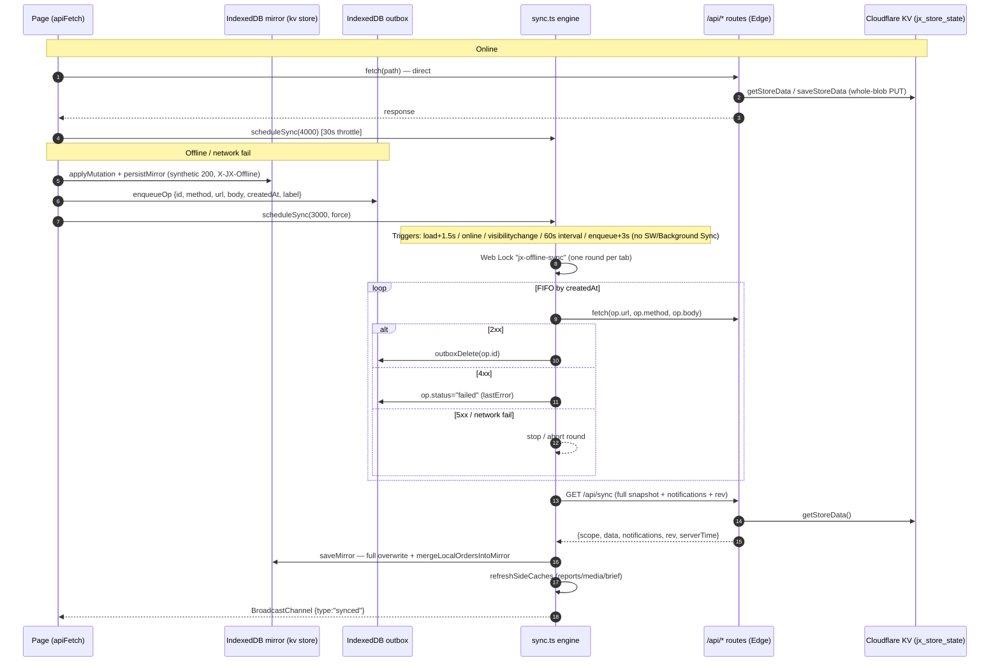

# P8 — অফলাইন-ফার্স্ট সিঙ্ক লেয়ার রিভিউ

- তারিখ: ২০২৬-১০-০৩
- স্কোপ: আনকমিটেড অফলাইন কাজ (working tree) — `src/lib/offline/**`, `public/sw.js`, `src/app/api/sync/route.ts`, `src/lib/store.ts`, UI ইন্টিগ্রেশন
- পদ্ধতি: শুধুই স্ট্যাটিক রিভিউ (কোনো বিল্ড/রান নয়) + iOS Background Sync স্ট্যাটাসের ওয়েব যাচাই

---

## ১. বর্তমান স্থাপত্য (যা যা ইমপ্লিমেন্ট হয়েছে)

### ১.১ Mirror — IndexedDB-তে পুরো দোকানের কপি

ডেটাবেজ `jxshoes-offline` (version 1), দুইটি object store (`src/lib/offline/db.ts:7-27`):

| Store | Key | কী থাকে |
|---|---|---|
| `kv` | স্ট্রিং কী | `mirror` (পুরো `FullStoreData`: products, orders, categories, storeSettings, heroBanner, flashDeal, coupons, inventoryMovements, customers, expenses, duePayments), `meta` (`{rev, lastSyncAt, scope: 'admin'\|'public'}`), `notifications`, `reports`, `dailyBrief`, `mediaLibrary`, `localOrders` (পাবলিক স্কোপের অফলাইন অর্ডার, সর্বোচ্চ ৫০টা — `snapshot.ts:129-133`) |
| `outbox` | `keyPath: 'id'` | অফলাইন মিউটেশন সারি (`OutboxOp`) |

IndexedDB না থাকলে (প্রাইভেট মোড/পুরনো ব্রাউজার) **মেমরি ফলব্যাক** — ট্যাব বন্ধ হলেই আউটবক্স হারায় (`db.ts:13,64-77`)।

`/api/sync` (GET) অ্যাডমিন কুকি অনুযায়ী দুই স্কোপ দেয়: `admin` = পূর্ণ `FullStoreData` + notifications + `rev`-চেকসাম; `public` = শুধু স্টোরফ্রন্ট-সেফ ডেটা (orders/customers/expenses/duePayments/inventoryMovements খালি, `src/app/api/sync/route.ts:19-40`)। `rev` শুধু length-ভিত্তিক চেকসাম (route.ts:37,52-57) — ক্লায়েন্ট কখনো সার্ভারে নিজের `rev` ফেরত পাঠায় না, কন্ডিশনাল পুলও নেই; প্রতি রিফ্রেশেই পুরো স্ন্যাপশট নামে।

### ১.২ Outbox রেকর্ড শেপ

`OutboxOp` (`db.ts:110-121`):

```
{ id, method, url, body?, createdAt, attempts, lastError?, status: 'pending'|'failed', label }
```

- `id` = `localId('op')` → `op-off-<Date.now()>-<crypto.randomUUID প্রথম ৮ ক্যারেক্টার>` (`db.ts:124-130`) — **ULID/UUIDv7 নয়**, তবে লোকাল কলিশন প্রায় অসম্ভব।
- **নেই:** `deviceId`, ইডেম্পোটেন্সি কী, মিউটেশন সিকোয়েন্স নম্বর। অর্ডারিং = `createdAt` (ISO string) লেক্সিকোগ্রাফিক সর্ট (`sync.ts:98`) — FIFO।
- রিপ্লের সময় **body হুবহু enqueue-কালীন অবস্থায়** যায়; লোকাল আইডি (`ord-off-…`) মিররে থাকে, বডিতে যায় না — তাই সার্ভার নিজেই নতুন `ord-<Date.now()>` আইডি বানায় (`store.ts:425`) এবং **লোকাল↔সার্ভার আইডি ম্যাপিং কোথাও সংরক্ষিত হয় না**।

### ১.৩ apiFetch — রিড/রাইট রাউটিং (`src/lib/offline/apiFetch.ts`)

- **অনলাইন GET:** সরাসরি সার্ভার; সফল হলে `scheduleSync(4000)` (মিরর ফ্রেশ রাখা, sync.ts-এ ৩০ সেকেন্ড থ্রটল)।
- **অনলাইন মিউটেশন:** সরাসরি সার্ভার; 4xx হলে কিউ হয় না (পয়জন-প্রতিরোধ, apiFetch.ts:166-169); 5xx/নেটওয়ার্ক ব্যর্থ হলে নিচের অফলাইন পথ।
- **অফলাইন মিউটেশন:** `applyMutation()` দিয়ে মিররে লোকাল প্রয়োগ (`appliers.ts`) → `persistMirror` → `enqueueOp` → **synthetic 200 Response** (হেডার `X-JX-Offline: 1`) — পেজের `if (res.ok)` লজিক অক্ষত। অজানা রুট জেনেরিক কিউ হয় (`{ok:true, offlineQueued:true}`, apiFetch.ts:211-213)।
- **অফলাইন GET:** মিরর থেকে `buildOfflineGet()` — products/orders/customers/expenses/coupons/settings/marketing/inventory/finance/fast-movers সহ GET-অফলাইন রেসপন্স সিনথেসাইজ করে (`appliers.ts:612-712`)।
- ব্যতিক্রম: `/api/ai` কখনো কিউ হয় না (বাংলা 503 মেসেজ), `/api/admin-login` সরাসরি fetch, FormData আপলোড অফলাইনে data-URI প্রিভিউ (কিউ হয় না)।
- নোটিফিকেশন PUT/DELETE আলাদা ক্যাশে প্রয়োগ হয়ে কিউ হয় (apiFetch.ts:141-155)।

### ১.৪ রিপ্লে কখন চলে (`sync.ts:178-203`)

ট্রিগার: অ্যাপ লোডে ১.৫ সেকেন্ড; `online` ইভেন্ট (force); `visibilitychange` → visible (থ্রটলসহ); ৬০ সেকেন্ড ইন্টারভাল (৩০ সেকেন্ড রুটিন-থ্রটল); নতুন অপ কিউ হলে ৩ সেকেন্ড (force)। **Service Worker / Background Sync দিয়ে কোনো ট্রিগার নেই** — `sw.js`-এ `sync.register` অনুপস্থিত। একাধিক ট্যাবে Web Lock (`'jx-offline-sync'`) + `BroadcastChannel('jx-offline-sync')` দিয়ে স্ট্যাটাস (`sync.ts:79-89`)।

### ১.৫ ব্যর্থতা নীতি (`sync.ts:91-153`)

- প্রতি রাউন্ডে pending অপ FIFO-তে রিপ্লে (সরাসরি `fetch`, apiFetch এড়িয়ে — দ্বিগুণ কিউ এড়াতে)।
- 2xx → ডিলিট; **4xx → `failed` কোয়ারেন্টাইন** (`lastError = "সার্ভার বলছে: <status>"`), ম্যানুয়াল retry/discard পর্যন্ত থাকে; 5xx → রাউন্ড থামে; নেটওয়ার্ক ব্যর্থ → পুরো রাউন্ড বাতিল।
- **কোনো এক্সপোনেনশিয়াল ব্যাকঅফ নেই**, কোনো সর্বোচ্চ-চেষ্টা সীমা নেই — pending প্রতি রাউন্ডে আবার চেষ্টা হয়।
- রাউন্ড শেষে (replay>0, বা মিরর ≥৫ মিনিট পুরনো, বা force) **পুরো স্ন্যাপশট পুল** — মিরর সার্ভার-সত্যে সম্পূর্ণ ওভাররাইট (`snapshot.ts:157-173`) + side caches (reports/media/brief) রিফ্রেশ।

### ১.৬ কনফ্লিক্ট আচরণ

- ঘোষিত নীতি: **সার্ভার-অথরিটেটিভ** — রিপ্লের পরে পুরো মিরর স্ন্যাপশটে বদলে যায় (`OFFLINE_SYNC.md` §৩)। অর্থাৎ কার্যকর **LWW-by-replay-order**; কোনো ফিল্ড-লেভেল মার্জ বা ভার্সন নেই।
- স্টক/বাকি আসলে **ডেল্টা-হিসেবে** মুছে যায় না — রিপ্লে ক্রমে প্রতিটা অর্ডার/পেমেন্ট সার্ভারের কারেন্ট ভ্যালুর ওপর সিকোয়েনশিয়ালি প্রয়োগ হয় (`store.ts:458-491`, `store.ts:884`), তাই দুই ডিভাইসের অফলাইন সেল কার্যত জমা হয়। তবে **সরাসরি কাস্টমার-এডিটে `dueAmount` অ্যাবসোলিউট সেট** (`store.ts:829`, `appliers.ts:305`) — রিপ্লে অর্ডারের ওপর নির্ভরশীল, কমিউটেটিভ নয়।
- সার্ভার মার্জ = **পুরো `FullStoreData` JSON ব্লব read-modify-write** এক কীতে (`store.ts:95-155`): প্রতিটা মিউটেশন সম্পূর্ণ ডকুমেন্ট PUT করে — দুই কনকারেন্ট রিকোয়েস্টে (দুই ডিভাইসের সমান্তরাল রিপ্লে বা দুই এজ আইসোলেট) শেষ লেখক জেতে, আগের লেখার পরিবর্তন হারায় (KV eventually-consistent, কোনো CAS/অ্যাটমিক অপারেশন নেই)।

### ১.৭ Service Worker (`public/sw.js`, v2)

- প্রিক্যাশ: `/`, `/admin`, `/shop` শেল (install, `allSettled`), তারপর `skipWaiting()`; activate-এ পুরনো ক্যাশ ডিলিট + `clients.claim()`।
- `/_next/static`, `/icons`, ইমেজ এক্সটেনশন → **cache-first**; `/api/media/*` (R2) → cache-first; নেভিগেশন → **network-first**, অফলাইনে ক্যাশড রেসপন্স → ফলব্যাক `/admin` শেল; বাকি `/api/` SW স্পর্শই করে না (ডেটা apiFetch+মিররের দায়িত্ব)।
- ক্যাশ ভার্সন বাম্প = `CACHE` কনস্ট্যান্ট হাতে বদলানো; কোনো ক্যাপ/প্রুনিং নেই — প্রতিটি ভিজিট করা পেজ ও ইমেজ চিরকালের জন্য জমে।

### ১.৮ UI ইন্টিগ্রেশন

`OfflineProvider` রুট লেআউটে (`layout.tsx:50`) — অফলাইন/পেন্ডিং/ব্যর্থ ব্যানার + সিঙ্ক সেন্টার (প্রতি-অop discard, সব-failed retry/discard); `AdminSidebar`-এ `SyncStatusBadge` (ক্লিকে ম্যানুয়াল সিঙ্ক); order-success পেজে `X-JX-Offline`/`ord-off-` শনাক্ত করে অফলাইন নোটিশ। ২৫টি ফাইল `apiFetch` ব্যবহার করে — তবে **একটি গুরুত্বপূর্ণ ব্যতিক্রম** নিচের Gap #A।

---

## ২. সিঙ্ক ফ্লো ডায়াগ্রাম (যেমন ইমপ্লিমেন্ট হয়েছে)



---

## ৩. লক্ষ্য-চুক্তির (Target Sync Contract) সাথে গ্যাপ তালিকা

তীব্রতা: **High** = ডেটা হারানো/ডুপ্লিকেট বিক্রির ঝুঁকি; **Medium** = স্কেল/দক্ষতা/সঠিকতা ঝুঁকি; **Low** = অভিজ্ঞতা/পরিপাটি।

| # | বিষয় | বর্তমান | লক্ষ্য | তীব্রতা | Evidence |
|---|---|---|---|---|---|
| A | **প্রোডাক্ট সেভ অফলাইনে নীরবে হারায়** | অ্যাডমিন প্রোডাক্ট তৈরি/এডিট raw `fetch` ব্যবহার করে — apiFetch/মিরর/আউটবক্স বাইপাস; অফলাইনে fail → `console.error` ছাড়া কিছুই না। `OFFLINE_SYNC.md` §২-এর "সব পেজ এখন apiFetch" দাবির বিপরীত | সব মিউটেশন কিউ হবে | **High** | `src/app/admin/products/page.tsx:249`; `docs/OFFLINE_SYNC.md:26` |
| B | ইডেম্পোটেন্সি কী নেই → **ডুপ্লিকেট বিক্রি** | রিপ্লে সার্ভার-সাইডে প্রসেস হয়ে গেলেও রেসপন্স হারালে (টাইমআউট/ট্যাব বন্ধ) অপ pending থেকে আবার POST — সার্ভারে কোনো ডিডাপ নেই | প্রতি অপে idempotency key; সার্ভার duplicate রিটার্ন করবে | **High** | `src/lib/offline/sync.ts:105-131`; `src/lib/store.ts:423-508` (insert without dedup) |
| C | deviceId নেই | OutboxOp/বডি/হেডার — কোথাও ডিভাইস আইডেন্টিটি নেই | প্রতিটি মিউটেশনে deviceId | **High** | `src/lib/offline/db.ts:110-121`; `apiFetch.ts:45-59` |
| D | ক্লায়েন্ট আইডি সার্ভারে যায় না; আইডি ম্যাপিং ভাঙে | অফলাইন অর্ডার `ord-off-…` মিররে, রিপ্লেতে সার্ভার নতুন `ord-<Date.now()>` বানায়; `clearLocalOrders()` **কোথাও ডাকা হয় না**, `mergeLocalOrdersIntoMirror` আইডি-ম্যাচ করতে না পেরে লোকাল অর্ডার প্রতি স্ন্যাপশটের পরে আবার ঢোকায় → পাবলিক মিররে ডুপ্লিকেট অর্ডার জমে | ক্লায়েন্ট-জেনারেটেড ULID/UUIDv7 সার্ভার সম্মান করবে | **High** | `src/lib/offline/db.ts:124-130`; `appliers.ts:146`; `store.ts:425`; `snapshot.ts:136-154` |
| E | ইনভয়েস নম্বর কলিশন | `SK-<1000–9999>` র‍্যান্ডম — অনলাইন (store.ts) ও অফলাইন (appliers.ts) একই ৯০০০-স্পেস, ডিভাইস প্রিফিক্স/কাউন্টার নেই; ~১১০+ অর্ডারে কলিশন সম্ভাবনা ৫০%+ | ডিভাইস-প্রিফিক্সড নম্বরিং | **High** | `appliers.ts:137,258`; `store.ts:426,755` |
| F | `navigator.storage.persist()` অনুরোধ করা হয়নি | কোডবেজে কোথাও নেই — মিরর+আউটবক্স best-effort; স্টোরেজ চাপে/iOS-এ (হোম-স্ক্রিনে না থাকলে ~৭ দিন অব্যবহৃত) অনুমোদন ছাড়া eviction সম্ভব — **আনসিঙ্কড বিক্রি হারানোর ঝুঁকি** | persist() অনুরোধ + persisted স্টেটাস UI-তে | **High** | grep: zero matches; `OfflineProvider.tsx:82-111` (init-এ নেই) |
| G | সার্ভার মার্জ = পুরো JSON ব্লব overwrite | প্রতিটি মিউটেশন সম্পূর্ণ `FullStoreData` read-modify-write এক KV কীতে; কনকারেন্ট লেখায় last-write-wins — এক অর্ডারের স্টক-কাট/নোটিফিকেশন হারাতে পারে | প্রতি-এনটিটি অ্যাটমিক মার্জ | **High** | `store.ts:95-155` (`saveStoreData`); `store.ts:424,494` |
| H | কনফ্লিক্ট পলিসি per-entity নয় | স্টক/বাকি রিপ্লে-ক্রমে কার্যত ডেল্টা (ভালো), কিন্তু কাস্টমার-এডিটে `dueAmount` অ্যাবসোলিউট ওভাররাইট; প্রোডাক্ট এডিট full-object merge (LWW, ভার্সন/ফিল্ড-মার্জ নেই); orders/movements append-only কিন্তু `Date.now()` আইডি | orders/payments/movements append-only; stock/due ডেল্টা; প্রোডাক্ট ভার্সনড মার্জ; সার্ভার টাইম অথরিটেটিভ (বর্তমানে ক্লায়েন্ট `createdAt` রিপ্লেতে অপরিবর্তিত থাকে) | **Medium** | `store.ts:829`; `appliers.ts:119,305`; `store.ts:270` (`mov-<Date.now()>`) |
| I | Server change feed / cursor / টম্বস্টোন নেই | শুধু GET ফুল-স্ন্যাপশট; `rev` length-চেকসাম — এডিট ধরে না, ক্লায়েন্ট ফেরতও পাঠায় না; ডিলিট প্রোপাগেট হয় শুধু ফুল-ওভাররাইটের কল্যাণে | `change_log(seq)` cursor-পুল, টম্বস্টোনসহ; ডিভাইস-টাইমস্ট্যাম্প নয় | **Medium** | `api/sync/route.ts:14-63`; `snapshot.ts:157-173` |
| J | `POST /api/sync/push` / `GET /api/sync/pull?cursor=` নেই | রিপ্লে = আলাদা আলাদা REST কল; ফল শুধু ok/4xx/5xx — applied/duplicate/conflict/rejected+reason কোনোটাই নেই | ব্যাচ push + per-op রেজাল্ট; cursor pull | **Medium** | `src/app/api/sync/route.ts` (GET only); `sync.ts:105-131` |
| K | ক্যাটালগ ডেল্টা আপডেট নেই | প্রতি রিফ্রেশে (replay/৫ মিনিট/অনলাইন GET-ট্রিগার) পুরো ক্যাটালগ+অর্ডার+মুভমেন্ট নামে; `inventoryMovements` আনবাউন্ডেড বাড়ে (কোনো প্রুনিং নেই) → স্ন্যাপশট ও sync খরচ সময়ের সাথে ফুলে ওঠে | snapshot + delta | **Medium** | `sync.ts:134-141`; `apiFetch.ts:105,163`; `store.ts:273,309,356,475,729` |
| L | sw.js stale-cache/গ্রোথ ঝুঁকি | `skipWaiting`+`clients.claim`+activate-এ পুরনো ক্যাশ ডিলিট → ডিপ্লয়ের সময় খোলা ট্যাব পুরনো content-hashed চাংক চাইলে 404; নেভিগেশন+ইমেজ ক্যাশ আনবাউন্ডেড (কোনো ক্যাপ/LRU নেই); **অফলাইনে যেকোনো পাবলিক পেজে `/admin` শেল ফেরত যায়** (ভুল শেল) | ভার্সনড ক্যাশ নীতি, ক্যাপড ক্যাশ, সঠিক শেল ফলব্যাক | **Medium** | `sw.js:11-27,37-46,59-60,68-84` |
| M | অফলাইন UI: প্রায় পূর্ণ, সামান্য ঘাটতি | ইন্ডিকেটর+পেন্ডিং কাউন্ট+failed স্ক্রিন+retry/discard আছে; নেই: pending অপের **প্রতিটির আলাদা retry** (শুধু discard আছে), ম্যানুয়াল resolve/এডিট, বানানো-মানুষের এরর মেসেজ (raw "সার্ভার বলছে: 401") | failed-operations screen + retry/manual resolve | **Low** | `OfflineProvider.tsx:194-318`; `sync.ts:119` |
| N | iOS Safari Background Sync | **ব্যবহারই হয়নি** — তাই কিছু ভাঙে না; বর্তমান ট্রিগার (online/visibility/timer) কেবল পেজ/অ্যাপ খোলা থাকলে চলে। যাচাইকৃত (২০২৬-১০-০৩): Background Sync API **Safari/iOS-এ অসমর্থিত, Chromium-only** (MDN compat table; caniuse; WebKit-এ শুধু feature request — ২০২৬ সালের PWA কম্প্যাটিবিলিটি রিপোর্টেও অপরিবর্তিত) | (তথ্যগত) ভবিষ্যৎ পরিকল্পনায় Background Sync নির্ভর করা যাবে না — iOS-এ fallback: অ্যাপ-খোলায় ১.৫s সিঙ্ক (বর্তমান ডিজাইনই সঠিক) | **Low (তথ্য)** | `sync.ts:178-203`; Sources: [MDN Background Synchronization API](https://developer.mozilla.org/en-US/docs/Web/API/Background_Synchronization_API), [caniuse](https://caniuse.com/?search=background%20sync), [MagicBell PWA iOS limitations, 2026](https://www.magicbell.com), [TestMu AI, May 2026](https://www.testmuai.com) |
| O | AI/ভয়েস অফলাইন ডিগ্রেডেশন | ভালোই: `/api/ai` কিউ হয় না, বাংলা 503 মেসেজ; ব্রিফ/রিপোর্ট ক্যাশ অফলাইনে দেখা যায়; ভয়েস রেকর্ডিং হলেও ট্রান্সক্রিপশন নেটওয়ার্ক চায় → বাংলা এরর | বাংলা মেসেজিং সহ graceful degrade — মূলত পূরণ হয়েছে | **Low** | `apiFetch.ts:24-25,114-117,128-134`; `AdminAiFab.tsx:186,264`; `admin/assistant/page.tsx:285` |
| P | data-URI ছবি আউটবক্স/ব্লব ফোলানো | অফলাইন আপলোড data-URI দেয়; পরে সেই URI প্রোডাক্ট/ক্যাটাগরি পে-লোডে ঢুকে আউটবক্স বডি + KV ব্লব বড় করে; R2-তে স্বয়ংক্রিয় রি-আপলোড নেই (ডকে স্বীকৃত) | আপলোড কিউ + R2 রি-আপলোড | **Medium** | `apiFetch.ts:177-188`; `OFFLINE_SYNC.md:89-91` |
| Q | প্রাইভেট মোডে আউটবক্স হারায় | IndexedDB না থাকলে মেমরি ফলব্যাক — ট্যাব বন্ধ = আনসিঙ্কড ডেটা শেষ | সতর্কবার্তা/পার্সিস্টেন্ট ফলব্যাপ | **Medium** | `db.ts:13,64-77` |
| R | অফলাইনে অ্যাডমিন কুকি শেষ হলে | রিপ্লেতে 401 → সব অপ চিরতরে `failed` — রি-লগইনের পরে ম্যানুয়াল retry লাগবে; মেসেজে সেটা পরিষ্কার নয় | 401-সচেতন হ্যান্ডলিং | **Low** | `sync.ts:115-121`; `OFFLINE_SYNC.md:94-95` |

**ভালো দিক (স্বীকৃতি):** FIFO outbox + 4xx কোয়ারেন্টাইন ডিজাইন সঠিক; synthetic Response পেজ-লজিক অক্ষত রাখে; public/admin স্কোপ বিভাজন নিরাপদ (costPrice/customers পাবলিকে যায় না); নোটিফিকেশন প্রতি-কী লেখা (RMW রেস এড়ানো, `store.ts:1121-1126`); Web Locks + BroadcastChannel; পয়জন-অপ UI; side-cache সহনশীলতা।

---

## ৪. Quick Wins (ছোট, কাঠামো না ভাঙা সংশোধন)

1. **`src/app/admin/products/page.tsx:249`-এর raw `fetch` → `apiFetch`** — এক-লাইন ধরনের ফিক্স; অফলাইনে প্রোডাক্ট সেভ নীরবে হারানো বন্ধ হবে (Gap A)।
2. **`OfflineProvider` init-এ `navigator.storage.persist()` অনুরোধ** (সাথে `storage.persisted()` চেক) — আনসিঙ্কড বিক্রি eviction-হারানোর ঝুঁকি কমবে (Gap F)।
3. **OutboxOp-এ `deviceId` + ইডেম্পোটেন্সি কী যোগ করা** এবং রিপ্লেতে হেডার/বডিতে পাঠানো; সার্ভারে সস্তা ডিডাপ (সদ্য-প্রসেসড কী-র ছোট সেট) (Gap B, C)।
4. **`POST /api/orders` বডিতে `clientOrderId` পাঠিয়ে সার্ভারকে সেটি সম্মান করানো** + রিপ্লে সফল হলে `clearLocalOrders()` ডাকা — আইডি ম্যাপিং, ডুপ্লিকেট-অর্ডার ডিসপ্লে ও ডুপ্লিকেট বিক্রি একসাথে কমবে (Gap B, D)।
5. **ইনভয়েস নম্বরে ডিভাইস প্রিফিক্স/কাউন্টার** (যেমন `SK-<device>-<seq>`) — অফলাইন কলিশন দূর (Gap E)।
6. **sw.js ছোট সংশোধন:** পাবলিক পেজের অফলাইন ফলব্যাকে ভুল `/admin` শেল না পাঠানো; নেভিগেশন ক্যাশে সামান্য ক্যাপ (যেমন শেষ Nটি); ক্যাশ-ভার্সন বাম্প প্রক্রিয়া ডকুমেন্ট করা (Gap L)।
7. **কাস্টমার-এডিটে `dueAmount` অ্যাবসোলিউট সেট বন্ধ করে ডেল্টা/নিষেধ** এবং failed-অপের raw status-এর বদলে বোঝানো বাংলা নির্দেশ (Gap H, M, R)।

## ৫. Structural Changes (বড় কাঠামোগত কাজ)

1. **সার্ভার change feed:** `change_log(seq)` টেবিল/কী + টম্বস্টোন, cursor-ভিত্তিক `GET /api/sync/pull?cursor=` — device-timestamp নয়, monotonic seq।
2. **`POST /api/sync/push`** — ব্যাচ অপ, per-operation ফল: `applied / duplicate / conflict / rejected + reason`।
3. **Whole-blob KV RMW বাদ:** প্রতি-এনটিটি কী, বা D1/Durable Object-এ অ্যাটমিক মার্জ — কনকারেন্ট লস্ট-আপডেট বন্ধ (Gap G)।
4. **Per-entity কনফ্লিক্ট পলিসি:** orders/payments/movements append-only (কোনো কনফ্লিক্ট নেই); stock/due শুধু ডেল্টা; প্রোডাক্ট এডিট ভার্সনড ফিল্ড-মার্জ বা সুস্পষ্ট LWW; সার্ভার টাইম অথরিটেটিভ।
5. **ক্লায়েন্ট-জেনারেটেড ULID/UUIDv7 সর্বত্র** — সার্ভার ক্লায়েন্ট আইডিই চূড়ান্ত আইডি হিসেবে নেবে; `Date.now()`-ভিত্তিক সার্ভার আইডি ত্যাগ।
6. **ক্যাটালগ snapshot+delta** (ETag/rev শর্তসাপেক্ষ পুল) + `inventoryMovements` প্রুনিং/আর্কাইভ নীতি — sync খরচ ডেটার সাইজের সাথে লিনিয়ার না হয়ে পরিবর্তনের সাইজে হোক।
7. **আপলোড-কিউ স্থাপত্য:** অফলাইন ইমেজ স্থায়ী স্টোরে রেখে সিঙ্কে R2-তে আপলোড ও URL-রিরাইট (data-URI ব্লব-ফোলানো বন্ধ)।

---

## ৬. যাচাই হয়নি (Not verified)

- কোনো বিল্ড/ডেভ/টেস্ট রান করা হয়নি (নিষেধ) — সব ফাইন্ডিং স্ট্যাটিক কোড-পাঠ থেকে; রানটাইম আচরণ (synthetic Response-এ Next.js রাউটিং, SW-নেভিগেশন ইন্টারঅ্যাকশন) প্রত্যক্ষ করা হয়নি।
- বাস্তব iOS Safari/স্ট্যান্ডঅ্যালোন PWA-তে IndexedDB eviction (~৭-দিন ক্যাপ) ও `storage.persist()` আচরণ ডিভাইসে পরীক্ষা করা হয়নি।
- প্রোডাকশন Cloudflare KV-র eventual-consistency উইন্ডো/রেস পুনরুত্পাদন করা হয়নি — দুই ডিভাইসের সমান্তরাল রিপ্লের ডেটা-হারানো যুক্তি থেকে চিহ্নিত।
- বাস্তব ডেটায় মিরর/স্ন্যাপশট সাইজ (products+movement সহ) ও sync খরচ মাপা হয়নি।
- Web Locks না-থাকা ব্রাউজারে (পুরনো Safari/Firefox) সমান্তরাল ট্যাব-সিঙ্ক আচরণ পরীক্ষিত নয়।
- `public/sw-debug.js` প্রোডাকশনে কোথাও রেজিস্টার হয় কিনা নিশ্চিত নয় (কোডে রেজিস্ট্রেশন পাওয়া যায়নি — ডেভ-আর্টিফ্যাক্ট ধরা হয়েছে)।
- কুপন validate অফলাইন-পথ, নোটিফিকেশন `all:true` রিপ্লে, এবং FormData-আপলোড এজ-কেসগুলো হাতে-কলমে চালানো হয়নি।
